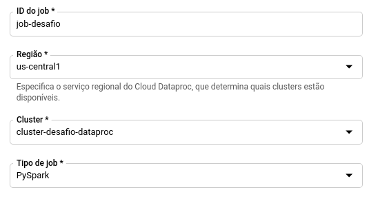

# Digital Innovation One

Código criado para utilização junto a plataforma da Digital Innovation One

<p align="center"></p>

## Desafio GCP Dataproc

O desafio faz parte do curso na plataforma da Digital Innovation One:

__*Criando um ecossitema Hadoop totalmente gerenciado com Google Cloud Platform*__

O desafio consiste em efetuar um processamento de dados utilizando o produto Dataproc do GCP. Esse processamento irá efetuar a contahem das palavras de um livro e informar quantas vezes cada palavra aparece no mesmo.

---

### Etapas do Desafio

1. Criar um bucket no Cloud Storage
1. Atualizar o arquivo ```contador.py``` com o nome do Bucket criado nas linhas que contém ```{SEU_BUCKET}```.
1. Fazer o upload dos arquivos ```contador.py``` e ```livro.txt``` para o bucket criado (instruções abaixo)
    - https://cloud.google.com/storage/docs/uploading-objects

1. Utilizar o código em um cluster Dataproc, executando um Job do tipo PySpark chamando ```gs://{SEU_BUCKET}/contador.py```
1. O Job irá gerar uma pasta no bucket chamada ```resultado```. Dentro dessa pasta o arquivo ```part-00000``` irá conter a lista de palavras e quantas vezes ela é repetida em todo o livro.

### Entrega do Resultado

1. Criar um repositório no GitHub.
1. Criar um arquivo chamado ```resultado.txt```. Dentro desse arquivo, colocar as 10 palavras que mais são usadas no livro, de acordo com o resultado do Job.
1. Inserir os arquivo ```resultado.txt``` e ```part-00000``` no repositório e informar na plataforma da Digital Innovation One.

---

### Ajudas
1. Ver nome do bucket: `gsutil ls`
1. Realizar upload dos arquivos  contador.py e livro.txt utilizando *Clound Shell*: `gsutil cp contador.py livro.txt gs://${SEU_BUCKET}/`




### O resultado seguiu os requisitos
1. Espaço vazio não é uma palavra
1. Letra não é uma palavra 
1. Não foi necessário nenhum algoritmo de ordenamento pela quatidade de determinada palavra. 

### Considerações Finais

NOTA: Se o Job mostrar um WARN de Interrupt, basta ignorar. Existe um bug no Hadoop que é conhecido. Isso não impacta no processamento.
